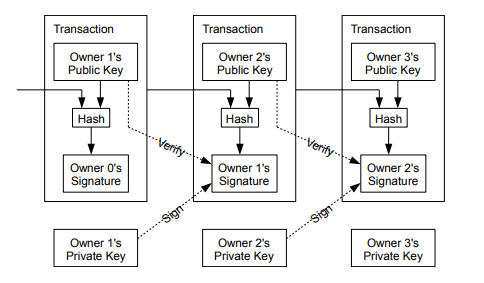
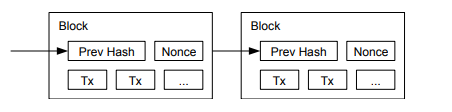
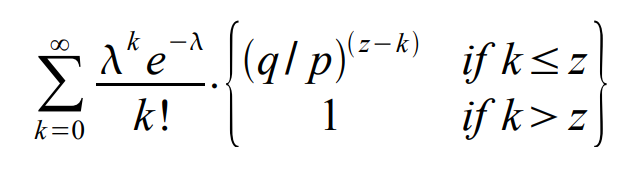

# Educational Python Bitcoin Clone

This project is a complete, pedagogical Python implementation of the original Bitcoin protocol as described in the Satoshi Nakamoto whitepaper. It is designed for educational purposes to demonstrate the core concepts of Bitcoin in a clear and concise way.

## Bitcoin Whitepaper

The foundation of this project is the original Bitcoin whitepaper by Satoshi Nakamoto. The whitepaper outlines the fundamental principles of a peer-to-peer electronic cash system. You can read the full whitepaper here:

[**Bitcoin: A Peer-to-Peer Electronic Cash System**](https://bitcoin.org/bitcoin.pdf)

## Technical Details

This implementation is built from the ground up in Python, relying on a minimal set of external libraries to showcase the core cryptographic and networking principles of Bitcoin.

*   **Transactions:** Transactions are the fundamental building blocks of the Bitcoin system. They are composed of inputs and outputs and are digitally signed to ensure authenticity.

    

*   **Cryptography:**
    *   **Elliptic Curve Digital Signature Algorithm (ECDSA):** The project uses the `ecdsa` Python package for creating and verifying digital signatures, which are essential for authenticating transactions.
    *   **SHA-256:** The Secure Hash Algorithm 256 is used for creating block hashes and transaction IDs, forming the backbone of the blockchain's integrity.
*   **Proof-of-Work (PoW):** The mining process involves finding a nonce that, when hashed with the block header, produces a hash with a certain number of leading zeros. This difficulty is adjustable and is a key component of the PoW consensus mechanism.

    

*   **Networking:**
    *   **TCP-based Peer-to-Peer:** The nodes communicate over a simple TCP-based P2P network. The protocol is custom-designed to be simple and illustrative, with messages for handshake, block/transaction inventory, and data exchange.
*   **Consensus:**
    *   **Nakamoto Consensus:** The network follows the longest-chain rule. When a node receives a new block, it verifies it and, if valid, adds it to its chain. If there's a fork, the longest chain is considered the valid one.
*   **In-Memory Data:**
    *   For simplicity, all blockchain data (blocks, transactions, UTXO set) is stored in memory. This means that restarting a a node will erase its state, and it will need to sync with other nodes to recover the blockchain history.

## Installation

Create a virtual environment or install dependencies directly:
```bash
pip install -r requirements.txt
```

---

## Step-by-Step Guide: Forming a P2P Network

You manage everything in this directory through a unified Master CLI tool called `main.py`.

### Step 1: Start the Genesis Node (Terminal 1)
Open a terminal and establish the first node in your network on port `10001`. We will use `--mine` to tell it to start hashing strictly according to the initial difficulty.

```bash
python main.py node --port 10001 --mine
```
*Note: This node does not have a `--connect` flag because it is acting as the bootstrap node. If you ever stop and restart this node, it will forget its history (as all data is in-memory). To recover its history, it must pull it back from a living peer!*

### Step 2: Connect a Second Node (Terminal 2)
Open a new terminal and start a second node on port `10002`. This time, we use the `--connect` flag to point it at the first node so they sync together.

```bash
python main.py node --port 10002 --connect 127.0.0.1:10001 --mine
```
*Behind the scenes: The nodes form a TCP P2P connection. Node 10002 verifies Node 10001\'s chain, instantly pulls any missing blocks, and they both begin competitively mining atop the exact same unified blockchain!*

### Step 3: Browse the Blockchain Explorer (Terminal 3)
At any point, open a third terminal and dynamically inspect the blockchain history currently known to either node:

**Summarize the entire chain (newest blocks first):**
```bash
python main.py explore --port 10001
```

**Inspect the exact cryptographic details of a specific block:**
```bash
python main.py explore --port 10001 --block 1
```

### Step 4: Interact with RPC Commands (Terminal 3)
You can directly ask your node to execute transactions or check memory pools:

**Check Node Status:**
```bash
python main.py client getinfo --port 10001
```

**Check Mining Balance:**
```bash
python main.py client balance --port 10001
```

**Send test funds to another address:**
```bash
python main.py client send --port 10001 --to <destination_address> --amount 50
```

---

## 5. Network Security Simulation
Instead of running nodes manually, you can run an automated script that securely spawns 3 Honest Nodes and an Attacker Node in parallel. It beautifully demonstrates Nakamoto Consensus, where the honest network routinely overtakes and orphans the attacker's fake chain!

```bash
python main.py simulate
```

## 6. Gambler's Ruin Calculator (Whitepaper Section 11)
Calculates the risk of an attacker reversing history. This is a direct implementation of the "Gambler's Ruin" problem described in section 11 of the whitepaper. It models the race between an attacker and the honest network.

The calculation uses the following variables:
*   **`q`**: The attacker's fraction of the total network hashrate (e.g., `0.3` for 30%).
*   **`p`**: The honest network's fraction of the hashrate (`p = 1 - q`).
*   **`z`**: The number of confirmations, or blocks the honest chain is ahead. This is the number of blocks the attacker needs to "catch up" to.
*   **`λ`**: A calculated value representing the expected number of blocks the attacker will find in the time it takes the honest network to find `z` blocks. It's the mean of a Poisson distribution.
*   **`k`**: An iterator variable representing the number of blocks the attacker actually finds (from 0 to `z`) in a given scenario during the calculation.



```bash
# Example: 30% attacker hashrate, 6 confirmations
python main.py math --q 0.3 --z 6
```

## 7. Testing
A comprehensive automated test suite validates the internal hashing logic, double-spend prevention, and chain reorganization dynamics.

```bash
python main.py test
```
